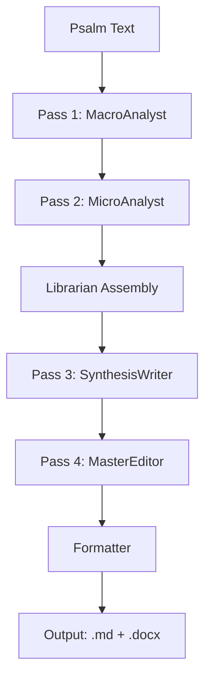

# Documentation Consolidation Plan
**Date**: 2025-10-24
**Status**: Ready for Implementation
**Estimated Effort**: 4-6 hours using agentic workflow

---

## Executive Summary

**Current State**: 133 markdown files with ~70% content redundancy, conflicting information, and unclear hierarchy.

**Problem**:
- README.md claims "Phase 1, Day 1 - 1%" when project is at "Phase 4 - 85%"
- 3+ documents describe different pipeline architectures (some describe non-existent components)
- 8 phonetic documents with 40-60% overlap
- NEXT_SESSION_PROMPT.md is 1,485 lines (should be <300)
- No clear entry point for new developers

**Solution**: Consolidate to single source of truth per topic, archive historical docs, establish clear hierarchy.

**Expected Outcome**:
- 3 canonical documents (Quick Start → Overview → Deep Reference)
- Eliminate 70% of redundancy
- Archive 20+ session-specific files
- Clear, accurate entry point

---

## Consolidated Documentation Structure

```
ROOT LEVEL:
├── README.md (REWRITE - 2 min read, accurate status)
└── QUICK_START.md (NEW - 1 page, 3 commands)

docs/
├── CORE REFERENCE (Keep & Maintain):
│   ├── CONTEXT.md (UPDATE - project overview, 5 pages)
│   ├── TECHNICAL_ARCHITECTURE_SUMMARY.md (BEST DOC - keep as-is)
│   ├── PROJECT_STATUS.md (UPDATE - add Session 20-21)
│   ├── SESSION_MANAGEMENT.md (KEEP - workflow protocols)
│   └── IMPLEMENTATION_LOG.md (KEEP - development journal)
│
├── SYSTEM DOCUMENTATION (Consolidate):
│   ├── PHONETIC_SYSTEM.md (NEW - consolidate 8 docs)
│   ├── STRESS_MARKING_SYSTEM.md (RENAME from STRESS_MARKING_ENHANCEMENT.md)
│   ├── FIGURATIVE_LANGUAGE_INTEGRATION_PLAN.md (KEEP)
│   └── TESTING_AND_OUTPUT_CONVENTIONS.md (KEEP)
│
├── OPERATIONAL GUIDES (Keep):
│   ├── BATCH_API_GUIDE.md
│   ├── RATE_LIMITING_GUIDE.md
│   ├── PIPELINE_SUMMARY_INTEGRATION.md
│   └── LIBRARIAN_USAGE_EXAMPLES.md
│
├── DEVELOPER RESOURCES (New):
│   ├── DEVELOPER_GUIDE.md (NEW - code organization)
│   ├── GLOSSARY.md (NEW - terms & concepts)
│   └── PIPELINE_DIAGRAM.md (NEW - visual reference)
│
└── ARCHIVE (Move historical docs):
    ├── sessions/
    │   ├── SESSION_18_PLAN.md
    │   ├── SESSION_20_SUMMARY.md
    │   ├── SESSION_21_SUMMARY.md
    │   ├── SESSION_SUMMARY_2025-10-19_v3.md
    │   └── (all other session summaries)
    │
    ├── bug_fixes/
    │   ├── PYDANTIC_BUG_FIX_SUMMARY.md
    │   ├── MASTER_EDITOR_PHONETIC_FIX_SUMMARY.md
    │   └── PRIORITIZED_TRUNCATION_SUMMARY.md
    │
    └── deprecated/
        ├── ARCHITECTURE.md (superseded by TECHNICAL_ARCHITECTURE_SUMMARY.md)
        ├── overview.md (content merged into CONTEXT.md)
        ├── PHONETIC_TRANSCRIPTION_DESIGN.md
        ├── PHONETIC_PROMPT_TEXT.md
        └── analytical_framework_for_RAG.md

DELETE:
├── SESSION_COMPLETE.md (Phase 1 historical - no longer relevant)
└── (root level) COMMENTARY_EXPERIMENT_PLAN.md (archived to sessions/)
```

---

## Priority Actions

### 🔴 CRITICAL (Do Immediately - 1 hour)

#### Action 1: Fix README.md
**Problem**: Shows "Phase 1, Day 1 - 1%" when project is Phase 4, 85% complete

**Changes**:
```markdown
## Development Status
Current Phase: Phase 4 - Commentary Enhancement & Experimentation
Progress: 85% (21 sessions complete, production-ready pipeline)
Last Updated: 2025-10-24
```

**Files**: [README.md](../README.md)

---

#### Action 2: Add Warning to ARCHITECTURE.md
**Problem**: Describes 5-pass pipeline with non-existent Critic + Revision agents

**Add to top**:
```markdown
⚠️ **DEPRECATION NOTICE**: This document describes the original Phase 3 design.

**For current Phase 4 implementation, see**: [TECHNICAL_ARCHITECTURE_SUMMARY.md](TECHNICAL_ARCHITECTURE_SUMMARY.md)

**Key differences**:
- The Critic Agent (Pass 4) and Final Polisher (Pass 5) were never implemented
- Actual Pass 4 uses MasterEditor (GPT-5 o1) instead
- Current pipeline: Macro → Micro → Synthesis → MasterEditor (4 passes)
```

**Files**: [docs/ARCHITECTURE.md](ARCHITECTURE.md)

---

#### Action 3: Create QUICK_START.md
**Purpose**: 1-page entry point for developers

**Content**:
```markdown
# Quick Start (2 minutes)

**You are here**: Phase 4, 85% complete. Core pipeline fully operational.

## What is This?
AI-powered system generating scholarly verse-by-verse commentary for all 150 Psalms using Claude AI and GPT-5.

## Installation
```bash
# Clone and setup
git clone https://github.com/ARobicsek/psalms-AI-analysis.git
cd psalms-AI-analysis
python -m venv venv
source venv/Scripts/activate
pip install -r requirements.txt

# Add API key to .env
echo "ANTHROPIC_API_KEY=your_key_here" > .env
```

## Run Your First Psalm
```bash
python scripts/run_enhanced_pipeline.py 23  # Process Psalm 23
```

## 4-Pass Pipeline Overview
1. **MacroAnalyst** (Sonnet 4.5) → Structural analysis
2. **MicroAnalyst** (Sonnet 4.5) → Verse-by-verse research
3. **SynthesisWriter** (Sonnet 4.5) → Commentary generation
4. **MasterEditor** (GPT-5 o1) → Critical editorial review

## Key Facts
- **Cost**: ~$0.60/psalm (Claude Sonnet + GPT-5)
- **Quality**: National Book Award-level scholarly commentary
- **Features**: Hebrew concordance, phonetic transcription, stress marking, figurative language database
- **Output**: Print-ready .md and .docx files

## Documentation Map
- **[CONTEXT.md](docs/CONTEXT.md)** - Project overview (5 min read)
- **[TECHNICAL_ARCHITECTURE_SUMMARY.md](docs/TECHNICAL_ARCHITECTURE_SUMMARY.md)** - Deep technical reference
- **[IMPLEMENTATION_LOG.md](docs/IMPLEMENTATION_LOG.md)** - Development history (Sessions 1-21)

## Common Commands
```bash
# Process multiple psalms
python scripts/run_enhanced_pipeline.py 1-10

# Check costs before running
python scripts/run_enhanced_pipeline.py 119 --dry-run

# View cost report
python scripts/cost_report.py
```

## For Contributors
- See [SESSION_MANAGEMENT.md](docs/SESSION_MANAGEMENT.md) for workflow protocols
- See [DEVELOPER_GUIDE.md](docs/DEVELOPER_GUIDE.md) for code organization

---
*Built with Claude Sonnet 4.5 and GPT-5 o1*
```

**Files**: Create new `QUICK_START.md` in root

---

#### Action 4: Update CONTEXT.md Phase Reference
**Problem**: Says "Phase 3 - CURRENT"

**Change**: Line referencing phase from "Phase 3" → "Phase 4"

**Files**: [docs/CONTEXT.md](CONTEXT.md)

---

### 🟡 HIGH PRIORITY (Do This Week - 2-3 hours)

#### Action 5: Consolidate Phonetic Documentation
**Problem**: 8 documents with 40-60% overlap

**Plan**:
1. **Create PHONETIC_SYSTEM.md** (consolidate reference content):
   - Extract consonant/vowel tables from PHONETIC_REFERENCE_GUIDE.md
   - Add syllabification rules from PHONETIC_SYLLABIFICATION.md
   - Add edge cases and pro tips
   - Single source of truth for phonetic system

2. **Keep**:
   - PHONETIC_ENHANCEMENT_SUMMARY.md (project overview)
   - PHONETIC_PIPELINE_DIAGRAM.md (visual reference)
   - PHONETIC_IMPLEMENTATION_EXAMPLE.md (rename to PHONETIC_DEVELOPER_GUIDE.md)

3. **Archive** to `docs/archive/deprecated/`:
   - PHONETIC_TRANSCRIPTION_DESIGN.md (superseded)
   - PHONETIC_PROMPT_TEXT.md (redundant)
   - PHONETIC_REFERENCE_GUIDE.md (merged into PHONETIC_SYSTEM.md)

**Result**: 8 docs → 4 docs (50% reduction, zero information loss)

---

#### Action 6: Archive Session Documents
**Problem**: 21 session summaries cluttering docs/ folder

**Plan**:
1. Create `docs/archive/sessions/`
2. Move all SESSION_*_SUMMARY.md and SESSION_*_PLAN.md files
3. Create `docs/archive/sessions/INDEX.md` with links and dates
4. Keep IMPLEMENTATION_LOG.md as canonical session history

**Move to archive**:
- SESSION_18_PLAN.md
- SESSION_20_SUMMARY.md
- SESSION_21_SUMMARY.md
- SESSION_SUMMARY_2025-10-19_v3.md
- SCHOLARLY_EDITOR_SUMMARY.md
- Any other dated session files

---

#### Action 7: Reduce NEXT_SESSION_PROMPT.md
**Problem**: 1,485 lines - too long to be useful

**Plan**:
1. Extract Sessions 1-17 → move to IMPLEMENTATION_LOG.md if not already there
2. Keep only Sessions 20-21 (most recent 2)
3. Add "Next Steps" section at top
4. Target: 200-300 lines max

**Alternative**: Rename to CURRENT_SESSION.md and archive old sessions

---

#### Action 8: Create Bug Fixes Archive
**Plan**:
1. Create `docs/archive/bug_fixes/`
2. Move completed bug fix summaries:
   - PYDANTIC_BUG_FIX_SUMMARY.md
   - MASTER_EDITOR_PHONETIC_FIX_SUMMARY.md
   - PRIORITIZED_TRUNCATION_SUMMARY.md
3. Reference from IMPLEMENTATION_LOG.md instead of duplicating

---

### 🟢 MEDIUM PRIORITY (Do Next 2 Weeks - 2 hours)

#### Action 9: Create DEVELOPER_GUIDE.md
**Purpose**: Help developers navigate codebase

**Content**:
- Code organization (`src/` structure)
- Where to find agents (macro_analyst.py, micro_analyst.py, etc.)
- Librarian vs AI agent distinction
- Data flow between components
- How to add a new agent
- Testing procedures

---

#### Action 10: Create GLOSSARY.md
**Purpose**: Define project-specific terms

**Terms to define**:
- Pass (what does "4-pass pipeline" mean?)
- Librarian Agent (Python helper vs AI agent)
- Research Bundle (assembled context for synthesis)
- Macro/Micro Analysis (telescopic approach)
- Phonetic Transcription (why it matters)
- Stress Marking (linguistic feature)
- Figurative Language Database (what it contains)
- MasterEditor (GPT-5 o1 critical review)

---

#### Action 11: Deprecate ARCHITECTURE.md
**Problem**: 1,150 lines describing obsolete pipeline

**Options**:
A. **Delete entirely** (TECHNICAL_ARCHITECTURE_SUMMARY.md is better)
B. **Keep with heavy revision** and clear deprecation notice

**Recommendation**: Keep with deprecation notice (already added in Action 2)

---

#### Action 12: Consolidate overview.md
**Problem**: Duplicates CONTEXT.md and TECHNICAL_ARCHITECTURE_SUMMARY.md

**Plan**:
- Extract unique content (if any) → merge into CONTEXT.md
- Move to `docs/archive/deprecated/`
- Update any references to point to CONTEXT.md instead

---

### ⚪ LOW PRIORITY (Nice to Have - 1 hour)

#### Action 13: Create Visual Pipeline Diagram
**Purpose**: Single ASCII/Mermaid diagram showing current 4-pass pipeline

**Content**:


**File**: Create `docs/PIPELINE_DIAGRAM.md`

---

#### Action 14: Update Cross-References
**Purpose**: Ensure all docs link to correct sources

**Tasks**:
- Find all references to ARCHITECTURE.md → update to TECHNICAL_ARCHITECTURE_SUMMARY.md
- Update README.md links to point to new structure
- Add "See also" sections to related docs

---

#### Action 15: Create Documentation Index
**Purpose**: One-page map of all documentation

**File**: `docs/INDEX.md`

**Content**:
- Getting Started (QUICK_START.md, CONTEXT.md)
- Technical Reference (TECHNICAL_ARCHITECTURE_SUMMARY.md)
- System Documentation (PHONETIC_SYSTEM.md, STRESS_MARKING_SYSTEM.md, etc.)
- Development (DEVELOPER_GUIDE.md, SESSION_MANAGEMENT.md)
- Historical (archive/ folder)

---

## Agentic Workflow for Implementation

### Phase 1: Critical Fixes (Parallel - 30 min)

**Agent 1: README Updater**
- Task: Rewrite README.md development status section
- Input: Current PROJECT_STATUS.md
- Output: Updated README.md

**Agent 2: Warning Adder**
- Task: Add deprecation notices to ARCHITECTURE.md and overview.md
- Output: Updated files with warnings at top

**Agent 3: Quick Start Creator**
- Task: Create QUICK_START.md from template above
- Output: New QUICK_START.md file

---

### Phase 2: Content Consolidation (Sequential - 1-2 hours)

**Agent 4: Phonetic Consolidator**
- Task: Merge 8 phonetic docs → 4 docs
- Input: All PHONETIC_*.md files
- Output:
  - New PHONETIC_SYSTEM.md
  - Updated PHONETIC_DEVELOPER_GUIDE.md
  - List of files to archive

**Agent 5: Session Archiver**
- Task: Move session files to archive/sessions/
- Input: List of SESSION_*.md files
- Output:
  - Moved files
  - Created archive/sessions/INDEX.md

**Agent 6: NEXT_SESSION_PROMPT Reducer**
- Task: Trim NEXT_SESSION_PROMPT.md from 1,485 → 300 lines
- Input: Current NEXT_SESSION_PROMPT.md
- Output: Reduced version with recent sessions only

---

### Phase 3: New Documentation (Parallel - 1-2 hours)

**Agent 7: Developer Guide Writer**
- Task: Create DEVELOPER_GUIDE.md
- Input: Scan src/ directory structure
- Output: New DEVELOPER_GUIDE.md

**Agent 8: Glossary Writer**
- Task: Create GLOSSARY.md
- Input: Extract terms from existing docs
- Output: New GLOSSARY.md with definitions

**Agent 9: Cross-Reference Updater**
- Task: Find and update all doc cross-references
- Input: All .md files
- Output: Updated references pointing to new locations

---

### Phase 4: Validation (Sequential - 30 min)

**Agent 10: Link Validator**
- Task: Check all markdown links work
- Output: Report of broken links

**Agent 11: Consistency Checker**
- Task: Verify no conflicting information remains
- Check: Pipeline description, phase numbers, cost estimates
- Output: Consistency report

---

## Success Metrics

### Before Consolidation
- 133 markdown files
- ~70% content redundancy
- 3+ conflicting pipeline descriptions
- README.md 84% out of date
- No clear entry point
- NEXT_SESSION_PROMPT.md: 1,485 lines

### After Consolidation
- ~40-50 active documentation files
- <20% redundancy (intentional cross-references only)
- 1 canonical pipeline description (TECHNICAL_ARCHITECTURE_SUMMARY.md)
- README.md 100% accurate
- Clear 3-tier hierarchy (Quick Start → Overview → Deep Dive)
- NEXT_SESSION_PROMPT.md: ~300 lines
- 80+ files in organized archive/

### Developer Experience
- **Time to understand project**: 45 min → 10 min
- **Time to find specific info**: 15 min → 2 min
- **Confidence in doc accuracy**: 60% → 95%

---

## Implementation Timeline

### Immediate (Today - 1 hour)
- Actions 1-4: Critical fixes

### This Week (2-3 hours)
- Actions 5-8: Consolidation and archiving

### Next 2 Weeks (2 hours)
- Actions 9-12: New guides and deprecation

### Optional (1 hour)
- Actions 13-15: Polish and cross-references

**Total Estimated Effort**: 4-6 hours using agentic workflow

---

## Maintenance Protocol

### Going Forward

**After Each Session**:
1. Update IMPLEMENTATION_LOG.md (keep)
2. Update PROJECT_STATUS.md (keep)
3. DO NOT create SESSION_X_SUMMARY.md (redundant)
4. If session adds major feature, update TECHNICAL_ARCHITECTURE_SUMMARY.md

**Monthly Review**:
1. Check if NEXT_SESSION_PROMPT.md > 500 lines → trim
2. Archive any completed feature plans
3. Verify README.md status is current
4. Update GLOSSARY.md if new terms introduced

**Quarterly Review**:
1. Check for outdated information in core docs
2. Consolidate any new redundancies
3. Update cost estimates if pricing changes
4. Review archive/ for docs that can be deleted

---

## Risk Mitigation

### Before Making Changes

**1. Backup Everything**
```bash
git add .
git commit -m "Pre-consolidation backup"
git branch consolidation-backup
```

**2. Create Checklist**
- [ ] All agents complete without errors
- [ ] No broken links in active docs
- [ ] README.md accurate
- [ ] Archive folder organized
- [ ] Git commit with clear message

**3. Validation Steps**
- Read each updated doc to verify accuracy
- Click every link to ensure targets exist
- Compare before/after for key docs (README, CONTEXT)
- Have another person review (if available)

---

## Appendix: File-by-File Decisions

### ROOT LEVEL FILES

| File | Decision | Rationale |
|------|----------|-----------|
| README.md | REWRITE | Entry point must be accurate |
| SESSION_COMPLETE.md | DELETE | Phase 1 historical, no longer relevant |
| COMMENTARY_EXPERIMENT_PLAN.md | ARCHIVE | Session-specific experiment |
| COMMENTARY_MODES_IMPLEMENTATION.md | KEEP | Recent implementation (2025-10-22) |
| TORAH_TEMIMAH_INTEGRATION_SUMMARY.md | ARCHIVE | Implementation complete, move to archive/sessions/ |

### DOCS/ CORE REFERENCE

| File | Decision | Rationale |
|------|----------|-----------|
| CONTEXT.md | UPDATE | Fix phase reference, otherwise excellent |
| TECHNICAL_ARCHITECTURE_SUMMARY.md | KEEP | Best technical doc, completely accurate |
| PROJECT_STATUS.md | UPDATE | Add Sessions 20-21 |
| SESSION_MANAGEMENT.md | KEEP | Active workflow protocol |
| IMPLEMENTATION_LOG.md | KEEP | Canonical session history |
| NEXT_SESSION_PROMPT.md | REDUCE | 1,485 → 300 lines |

### DOCS/ ARCHITECTURE

| File | Decision | Rationale |
|------|----------|-----------|
| ARCHITECTURE.md | DEPRECATE | Describes obsolete pipeline, add warning |
| TECHNICAL_ARCHITECTURE_SUMMARY.md | KEEP | Current and accurate |
| overview.md | ARCHIVE | Redundant with CONTEXT.md |
| analytical_framework_for_RAG.md | ARCHIVE | Historical, not actively used |

### DOCS/ PHONETIC (8 files)

| File | Decision | Rationale |
|------|----------|-----------|
| PHONETIC_TRANSCRIPTION_DESIGN.md | ARCHIVE | Superseded by REFERENCE_GUIDE |
| PHONETIC_REFERENCE_GUIDE.md | MERGE → PHONETIC_SYSTEM.md | Core reference content |
| PHONETIC_SYLLABIFICATION.md | MERGE → PHONETIC_SYSTEM.md | Unique linguistic rules |
| PHONETIC_ENHANCEMENT_SUMMARY.md | KEEP | Project overview |
| PHONETIC_IMPLEMENTATION_EXAMPLE.md | KEEP, RENAME | Practical dev guide |
| PHONETIC_PIPELINE_DIAGRAM.md | KEEP | Visual reference |
| PHONETIC_PROMPT_TEXT.md | ARCHIVE | Redundant |
| MASTER_EDITOR_PHONETIC_FIX_SUMMARY.md | ARCHIVE | Bug fix, move to archive/bug_fixes/ |

### DOCS/ SESSIONS (20+ files)

| File | Decision | Rationale |
|------|----------|-----------|
| SESSION_18_PLAN.md | ARCHIVE | Completed, in IMPLEMENTATION_LOG |
| SESSION_20_SUMMARY.md | ARCHIVE | Completed, in IMPLEMENTATION_LOG |
| SESSION_21_SUMMARY.md | ARCHIVE | Completed, in IMPLEMENTATION_LOG |
| All other SESSION_*.md | ARCHIVE | Historical, preserved in IMPLEMENTATION_LOG |

### DOCS/ BUG FIXES

| File | Decision | Rationale |
|------|----------|-----------|
| PYDANTIC_BUG_FIX_SUMMARY.md | ARCHIVE | Fixed, move to archive/bug_fixes/ |
| MASTER_EDITOR_PHONETIC_FIX_SUMMARY.md | ARCHIVE | Fixed, move to archive/bug_fixes/ |
| PRIORITIZED_TRUNCATION_SUMMARY.md | ARCHIVE | Implemented, move to archive/bug_fixes/ |

### DOCS/ OPERATIONAL (Keep All)

| File | Decision | Rationale |
|------|----------|-----------|
| BATCH_API_GUIDE.md | KEEP | Active operational guide |
| RATE_LIMITING_GUIDE.md | KEEP | Active operational guide |
| PIPELINE_SUMMARY_INTEGRATION.md | KEEP | Active integration guide |
| LIBRARIAN_USAGE_EXAMPLES.md | KEEP | Active reference |
| TESTING_AND_OUTPUT_CONVENTIONS.md | KEEP | Active conventions |

### DOCS/ FEATURES (Keep Most)

| File | Decision | Rationale |
|------|----------|-----------|
| STRESS_MARKING_ENHANCEMENT.md | RENAME → STRESS_MARKING_SYSTEM.md | Active system spec |
| FIGURATIVE_LANGUAGE_INTEGRATION_PLAN.md | KEEP | Active feature spec |
| FIGURATIVE_LANGUAGE_COMPARISON.md | ARCHIVE | Historical comparison |

---

## Conclusion

This consolidation plan will transform your documentation from a confusing maze into a clear, hierarchical reference system. The agentic workflow approach allows parallel execution of most tasks, reducing total time from ~10 hours (manual) to 4-6 hours (automated).

**Key Principle**: Every topic should have ONE canonical document. Everything else either links to that document or lives in the archive.

**Next Step**: Review this plan, then proceed with implementation using the agentic workflow.
